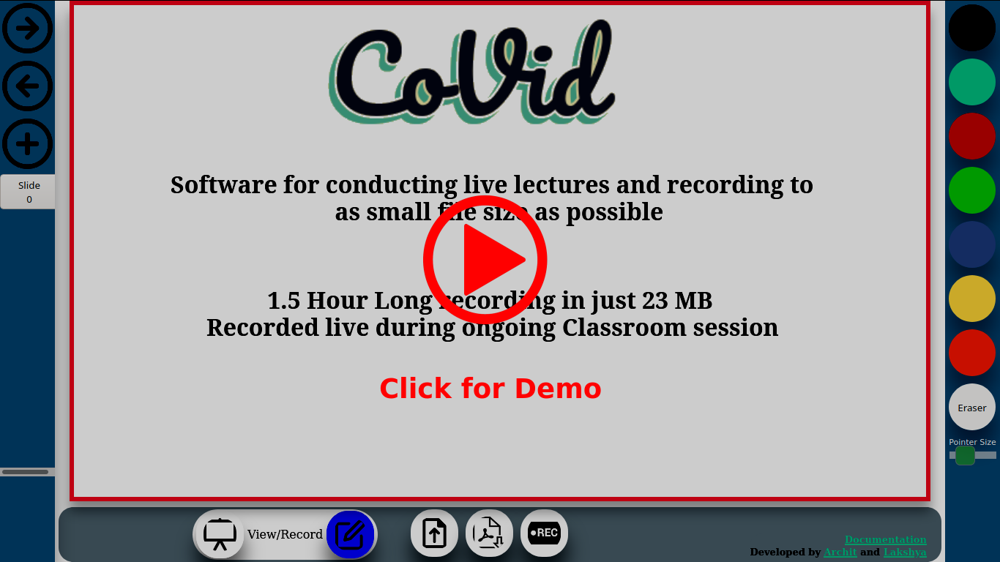

# CoVid

## Aim
To provide an environment for easy recording of university lectures and presentations, with a priority to reducing the recorded session file size.

Many students in our university face issues with attending online lectures(during the Covid pandemic and otherwise), mainly due to poor internet connectivity. They were not even able to download the large recorded lecture files. Through CoVid(Co - Video), we aim to reduce the recorded lecture file size. People even with bad internet coverage are able to download the small files easily and view the lecture recordings.

CoVid is a complete suite for conducting live lectures(paired with Google Meet/Zoom/Other video conferencing software) along with support for recording the lectures in as small file as possible. **Currently, a 1.5 hour long lecture presentation can be recorded in a file size of just 23 MB including audio, whereas a google meet recorded lecture would occupy a file size of roughly 477 MB for same length**.
We worked to ensure that the instructors need not change their workflow and hence, the software provides the following features:
1. Completely web browser-based - No software installation
2. Compatible with **existing live streaming services**(like Google Meet)
3. Support for importing base lectures(as PDF or images), which can be drawn upon during a recording session.
4. Support for touch devices.

## Usage
### For recording
* Load the recording mode()
* Click the start recording() button to start the recording session.
* Grant microphone access to record audio
* Option to import PDF/Image as base slides() to draw on top of(instructors mainly use it to load slides with questions written in them).
* Draw over the slides. Slide can be changed by usage of "Next slide", "Previous Slide", "New slide", buttons.
* Colors can be changed by panel on the right, and pointer size can be adjusted by the slider at the bottom.
* After recording session, click Stop Recording(). A file will be available for download. Distribute the file for sending the recorded session(Along with base lecture slides if used).

### For playback/viewing
* Load the viewing mode()
* Obtain the recorded file along with the base slides.
* Import the base slides(if any)().
* Import the recorded session file().
* Click on Play button(). Pause() option can be used during playback.

### FAQ
* Will I have to present the same content twice(Once for recording and once for live presentation)? 
  No, CoVid can be used live during an ongoing Google Meet/Video Conferencing in recording mode, and used as a presentation software. At the end of the presentation, the recorded content can be exported and distributed.
* Will the viewer have to upload the file over the internet to view the lecture content? 
  No, the website loads client side, and the internet can be disconnected once the site has loaded. The viewer needs to just load the file in the browser and will not be sent over the internet.
* Will a final PDF be available after the lecture session is concluded? 
  Yes, at the end of the lecture session, 2 files are provided, one contains the final state of the lecture slides, as a PDF. The other is an encoding of the entire duration of the lecture, and can be used to view the lecture again.